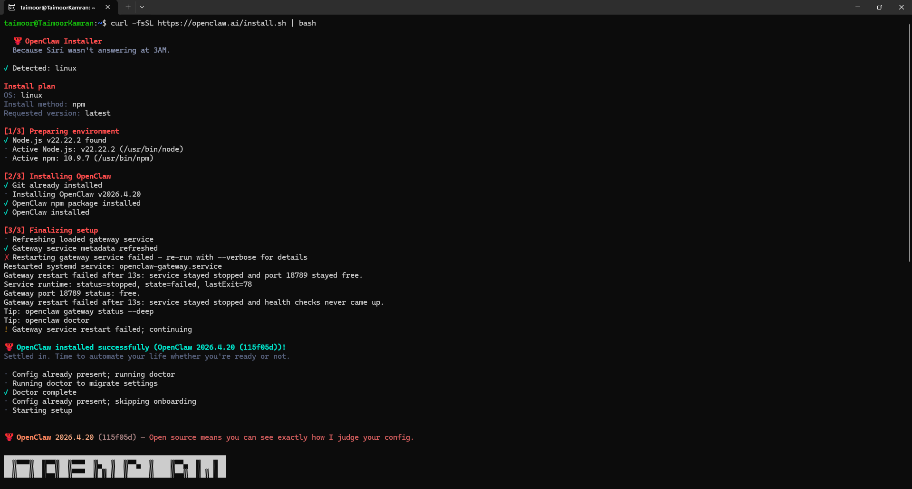
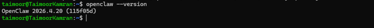

# OpenClaw AI — WSL2 + Ubuntu Setup Guide

If you prefer a Linux environment on Windows (recommended for the rest of this book), install OpenClaw inside WSL2 + Ubuntu. WSL gives you a real Linux terminal next to Windows, and every Linux command in this chapter then works exactly as written.

---

## Step 1: Enable WSL and Install Ubuntu

Open **Windows PowerShell as Administrator**.
Press the Windows key, type `powershell`, right-click **Windows PowerShell**, and select **Run as administrator**.

Then run:

```powershell
wsl --install -d Ubuntu
```


This single command enables the WSL feature, installs the WSL2 kernel, and downloads Ubuntu. **Reboot when prompted.**

After reboot, Ubuntu launches automatically and asks you to create a UNIX username and password. This account is separate from your Windows login. Pick something you will remember — you will need the password for `sudo`.

Verify the install from PowerShell:

```powershell
wsl -l -v
```


You should see Ubuntu with `STATE: Running` and `VERSION: 2`.

> **Reopen Ubuntu Later**
> Open Ubuntu from the Start menu, or just type `wsl` in any PowerShell window to drop into your default distro.

---

## Step 2: Install Channel SDK Dependencies (Optional but Recommended)

Before running the OpenClaw installer, install the messaging platform SDKs for WhatsApp, Slack, Discord, Telegram, Nostr, and Feishu. This lets the installer detect them automatically.

Inside the **Ubuntu terminal**, run:

```bash
npm install -g @larksuiteoapi/node-sdk @whiskeysockets/baileys @slack/web-api @slack/bolt @slack/socket-mode nostr-tools discord.js telegraf
```


When it finishes you will see:

```
added 327 packages in 29s

54 packages are looking for funding
  run `npm fund` for details
```


> **What these packages are for**
> | Package | Channel |
> |---|---|
> | `@whiskeysockets/baileys` | WhatsApp Web |
> | `@slack/web-api` `@slack/bolt` `@slack/socket-mode` | Slack |
> | `discord.js` | Discord |
> | `telegraf` | Telegram |
> | `nostr-tools` | Nostr |
> | `@larksuiteoapi/node-sdk` | Feishu / Lark |

---

## Step 3: Install OpenClaw

Inside the **Ubuntu terminal**, run the OpenClaw installer:

```bash
curl -fsSL https://openclaw.ai/install.sh | bash
```



The installer runs three stages and prints progress as it goes:

**[1/3] Preparing environment**

```
✓ Detected: linux
✓ Node.js v22.22.2 found
· Active Node.js: v22.22.2 (/usr/bin/node)
· Active npm: 10.9.7 (/usr/bin/npm)
```


**[2/3] Installing OpenClaw**

```
✓ Git already installed
· Installing OpenClaw v2026.4.21
✓ OpenClaw npm package installed
✓ OpenClaw installed
```


**[3/3] Finalizing setup**

```
✓ Gateway service metadata refreshed
```


When the installer finishes you will see:

```
🦞 OpenClaw installed successfully (OpenClaw 2026.4.21 (f788c88))!
```


> **Gateway Restart Warning**
> You may see `Gateway service restart failed — continuing`. This is normal on a fresh WSL install. The gateway starts correctly in Step 6 when you run the daemon setup.

> **npm Fallback**
> If the install script fails, run:
> ```bash
> npm install -g openclaw@latest
> ```

---

## Step 4: Fix PATH if `openclaw` is Not Found

If `openclaw --version` returns `command not found`, add OpenClaw to your shell PATH:

```bash
echo 'export PATH="$HOME/.openclaw/bin:$PATH"' >> ~/.bashrc
source ~/.bashrc
```


---

## Step 5: Complete the Setup Wizard

The installer launches the setup wizard automatically right after installation. Work through each screen as described below. If you need to restart the wizard later, run `openclaw`.

---

### 5a — Security Disclaimer

The first screen is a security notice. Read it, then select **Yes** to continue.


Key points:
- OpenClaw is in **Beta** — expect rough edges.
- It is a **personal agent by default** — one trusted operator boundary.
- If multiple users can message a tool-enabled agent, they share its tool authority.
- Run `openclaw security audit --deep` regularly.

---

### 5b — Setup Mode

Select **QuickStart**.


QuickStart keeps the default gateway settings:

| Setting | Value |
|---|---|
| Gateway port | 18789 |
| Gateway bind | Loopback (127.0.0.1) |
| Gateway auth | Token (default) |
| Tailscale exposure | Off |

---

### 5c — Config Handling

If a config file already exists the wizard will show what it detected. Select **Update values** to keep existing settings and only change what the wizard asks about.


---

### 5d — Model / Auth Provider

Select **Anthropic** as the provider.


For the auth method, select **Anthropic Claude CLI**. OpenClaw detects your existing Claude CLI login automatically.


You will see a confirmation:

```
Claude CLI auth detected; switched Anthropic model selection to the local Claude CLI backend.
Default model set to claude-cli/claude-opus-4-7
```


When asked **Default model**, select **Keep current**.

> **Model Not Found Warning**
> You may see `Model not found: claude-cli/claude-opus-4-7`. You can ignore this for now and update the model later with `openclaw config set agents.defaults.model <model>` or by running `/models list` inside the agent.

---

### 5e — Channel Status and Selection

The wizard lists every supported channel and its current status.


All channels will show **needs setup** on a fresh install. Use the arrow keys to select a channel and press **Enter** to configure it now, or scroll down and select **Skip for now** to configure channels later.


> You can configure channels any time by running `openclaw config`.

---

### 5f — Web Search Provider

OpenClaw can search the web when answering questions. Select a provider or choose **Skip for now** to enable it later.


> To enable web search later:
> ```bash
> openclaw configure --section web
> ```

---

### 5g — Skills

The wizard shows how many skills are ready to use.

```
Eligible: 12
Missing requirements: 34
Unsupported on this OS: 7
Blocked by allowlist: 0
```


Select **No** to skip skills configuration for now. You can enable skills later.

---

### 5h — Hooks

Hooks let you automate actions when agent commands run (for example, saving session context on `/reset`). Select **Skip for now**.


> To configure hooks later:
> ```
> https://docs.openclaw.ai/automation/hooks
> ```

---

### 5i — Gateway Service

The wizard installs the gateway as a **Node** service (stable and supported on WSL).


If the gateway is already installed, select **Restart** to apply the new configuration.


You will see:

```
◇  Gateway service restarted.
```

---

### 5j — Control UI

After the gateway restarts, the wizard shows your dashboard links:

```
Web UI: http://127.0.0.1:18789/
Web UI (with token): http://127.0.0.1:18789/#token=<your-token>
Gateway WS: ws://127.0.0.1:18789
Gateway: reachable
```


Save the tokenized URL — you will need it to open the dashboard.

> **Gateway Token**
> View your token anytime:
> ```bash
> openclaw config get gateway.auth.token
> ```

---

### 5k — Start TUI

The wizard offers to launch the Terminal UI (TUI) to personalize your agent. Select **Do this later** to finish setup first.


---

### 5l — Onboarding Complete

When you see the final screen, setup is done.

```
└  Onboarding complete. Use the dashboard link above to control OpenClaw.
```


---

## Step 6: Verify the Installation

```bash
openclaw --version
```



You should see:

```
OpenClaw 2026.4.21 (f788c88)
```

---

## Step 7: Install the Background Daemon

Register the OpenClaw gateway as a persistent systemd service so it starts automatically every time you open WSL:

```bash
openclaw onboard --install-daemon
```


This runs the same setup wizard again. Follow the same choices as Step 5. At the **Gateway service** screen the wizard will install and start the daemon.

When complete you will see:

```
└  Onboarding complete. Use the dashboard link above to control OpenClaw.
```


> **Stay Inside WSL**
> Run every OpenClaw command from your **Ubuntu terminal**, not from PowerShell. Files in `~/.openclaw/` live inside the Linux filesystem and are not visible to native Windows tools.

---

## Step 8: Open the Dashboard

```bash
openclaw dashboard
```


OpenClaw prints the dashboard URL, copies it to your clipboard, and opens it in your browser:

```
Dashboard URL: http://127.0.0.1:18789/#token=<your-token>
Copied to clipboard.
Opened in your browser. Keep that tab to control OpenClaw.
```


From the dashboard you can start chatting with your agent, connect channels, and manage settings.

---

> **Stay Inside WSL**
> From this point on, run every OpenClaw command from your **Ubuntu terminal**, not from PowerShell.

Continue with the **channel configuration** section to connect your first messaging platform.
