# OpenClaw AI — WSL2 + Ubuntu Setup Guide

If you prefer a Linux environment on Windows (recommended for the rest of this book), install OpenClaw inside WSL2 + Ubuntu. WSL gives you a real Linux terminal next to Windows, and every Linux command in this chapter then works exactly as written.

> **Before you start**
> - Windows 10 version 2004 or higher, or Windows 11
> - Node.js 22 or higher is required. Check with: `node --version`
> - A stable internet connection

---

## Step 1: Enable WSL and Install Ubuntu

Open **Windows PowerShell as Administrator**.
Press the Windows key, type `powershell`, right-click **Windows PowerShell**, and select **Run as administrator**.

Then run:

```powershell
wsl --install -d Ubuntu
```

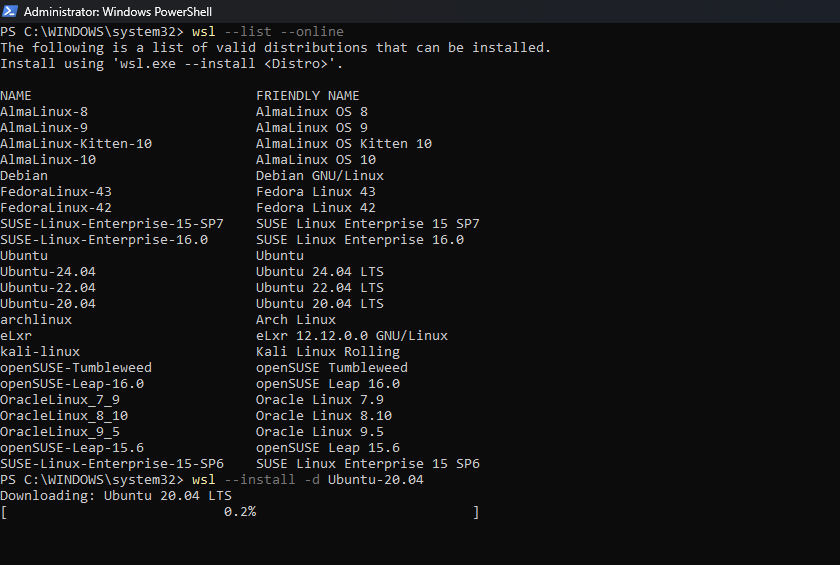

This single command enables the WSL feature, installs the WSL2 kernel, and downloads Ubuntu. **Reboot when prompted.**

After reboot, Ubuntu launches automatically and asks you to create a UNIX username and password. This account is separate from your Windows login. Pick something you will remember — you will need the password for `sudo`.

Verify the install from PowerShell:

```powershell
wsl -l -v
```

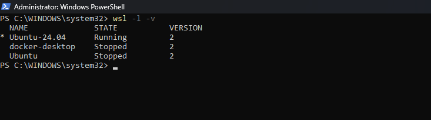

You should see Ubuntu with `STATE: Running` and `VERSION: 2`.

> **Reopen Ubuntu Later**
> Open Ubuntu from the Start menu, or just type `wsl` in any PowerShell window to drop into your default distro.

---

## Step 2: Install OpenClaw

Inside the **Ubuntu terminal**, run:

```bash
curl -fsSL https://openclaw.ai/install.sh | bash
```

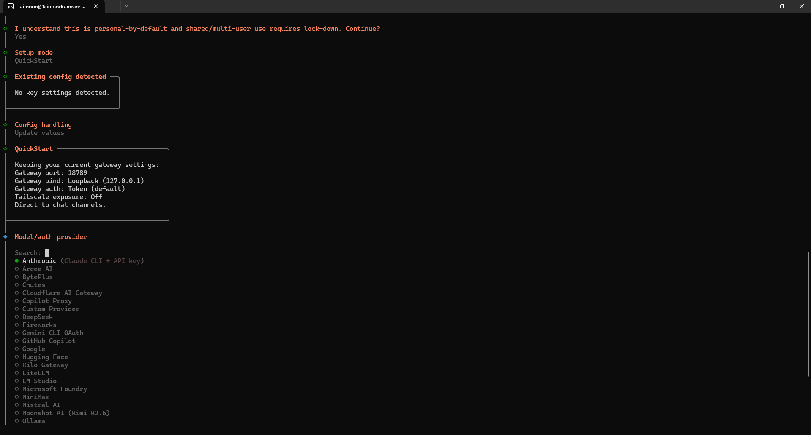

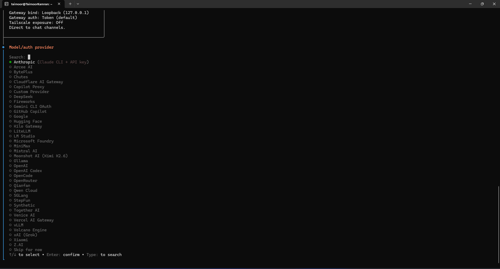

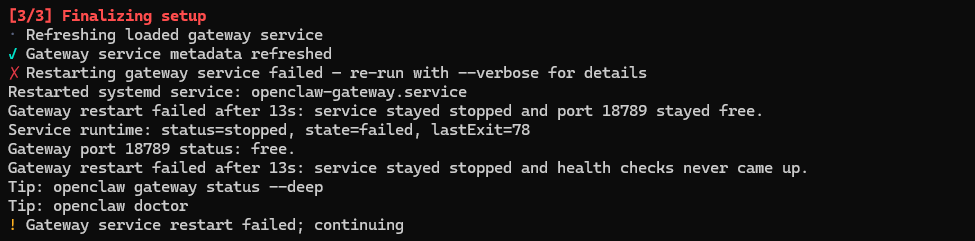


> **Gateway Restart Warning**
> You may see `Gateway service restart failed — continuing`. This is normal on a fresh WSL install and is fixed in Step 8.

> **npm Fallback**
> If the install script fails:
> ```bash
> npm install -g openclaw@latest
> ```

---

## Step 3: Install Channel SDK Dependencies

Inside the **Ubuntu terminal**, run:

```bash
npm install -g @larksuiteoapi/node-sdk @whiskeysockets/baileys @slack/web-api @slack/bolt @slack/socket-mode nostr-tools discord.js telegraf
```

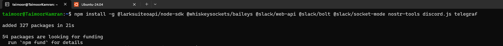

---

## Step 4: Fix PATH if `openclaw` is Not Found

If `openclaw --version` returns `command not found`, run:

```bash
echo 'export PATH="$HOME/.openclaw/bin:$PATH"' >> ~/.bashrc
source ~/.bashrc
```

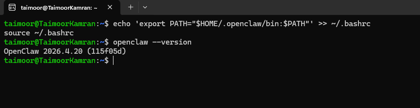

---

## Step 5: Complete the Setup Wizard

The installer launches the setup wizard automatically. If you need to restart it later, run `openclaw`.

### 5a — Security Disclaimer

Read the notice, then select **Yes**.

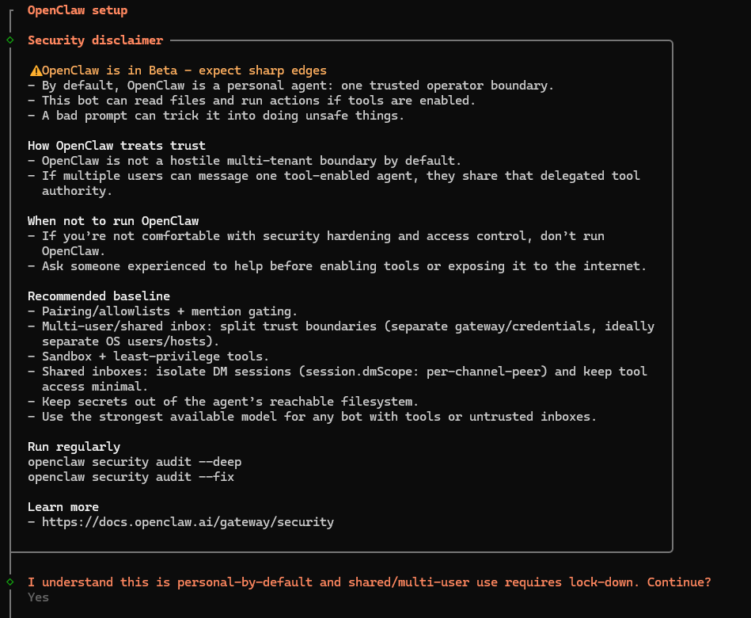

### 5b — Setup Mode

Select **QuickStart**.

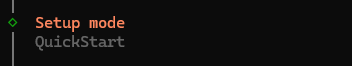

### 5c — Config Handling

Select **Update values**.

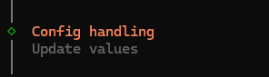

### 5d — Model / Auth Provider

Select **Anthropic**, then select **Anthropic Claude CLI**.

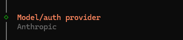


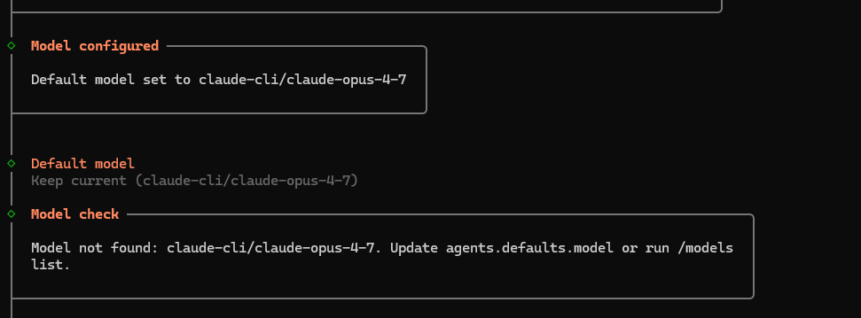

When asked **Default model**, select **Keep current**.

> **Model Not Found Warning**
> You may see `Model not found: claude-cli/claude-opus-4-7`. Ignore it for now — update the model later with `/models list` inside the agent.

### 5e — Channel Selection

Select **Skip for now**. You can connect channels any time by running `openclaw config`.

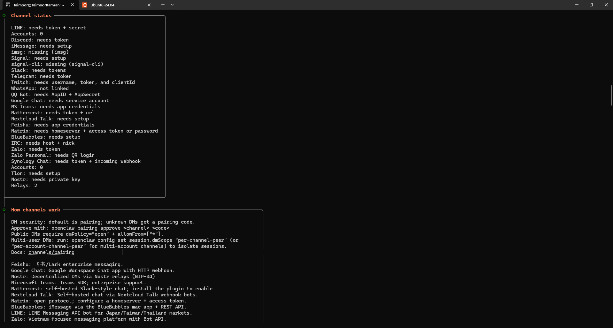

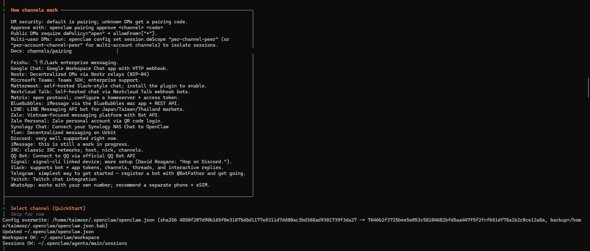

### 5f — Web Search

Select **Skip for now**.

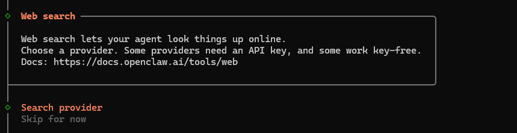

### 5g — Skills

Select **No**.

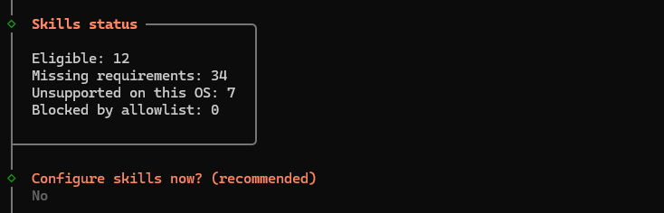

### 5h — Hooks

Select **Skip for now**.

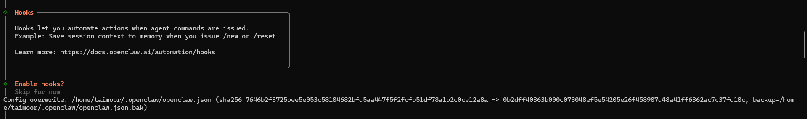

### 5i — Gateway Service

Select **Restart**.

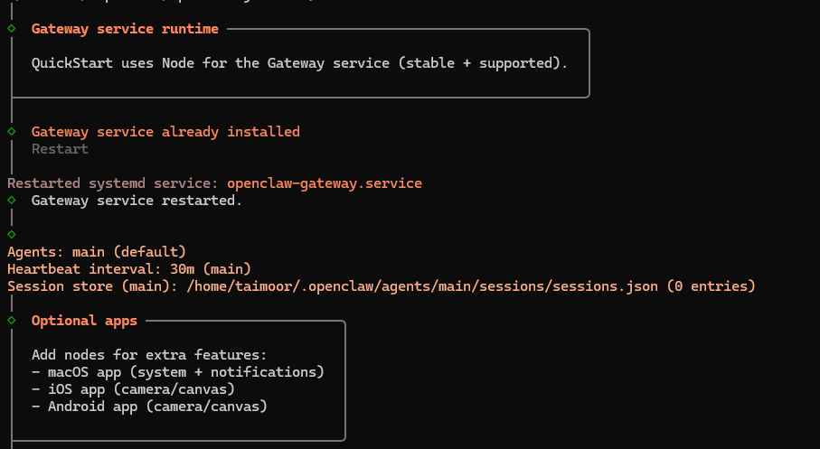

### 5j — Control UI

The wizard shows your dashboard URL. Save it.

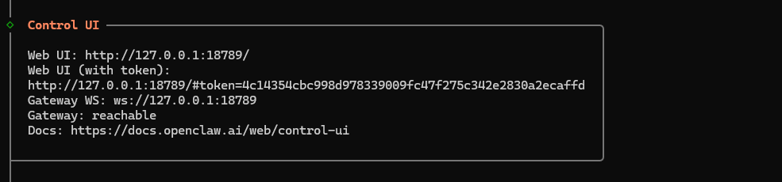

### 5k — Start TUI

Select **Do this later**.

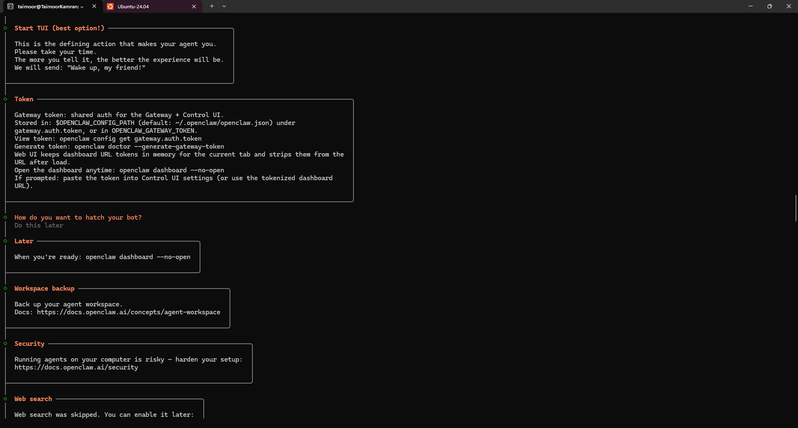

### 5l — Onboarding Complete

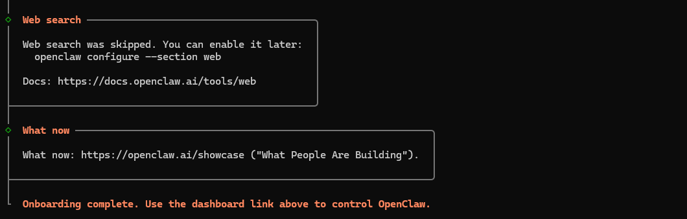

---

## Step 6: Verify the Installation

```bash
openclaw --version
```

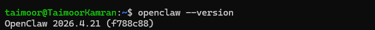

---

## Step 7: Install the Background Daemon

```bash
openclaw onboard --install-daemon
```

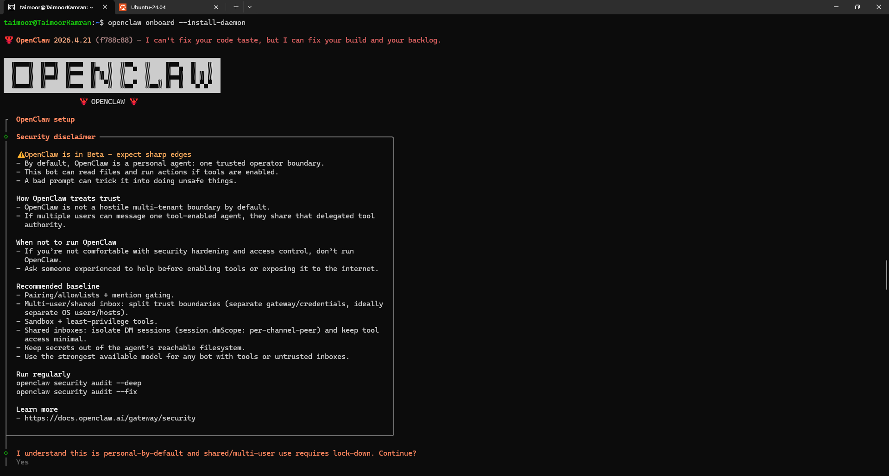

This re-runs the same wizard. Follow the same choices as Step 5.

> **Quick reference — select in order:**
> Yes → QuickStart → Update values → Anthropic → Claude CLI → Keep current → Skip → Skip → No → Skip → Restart → Do this later

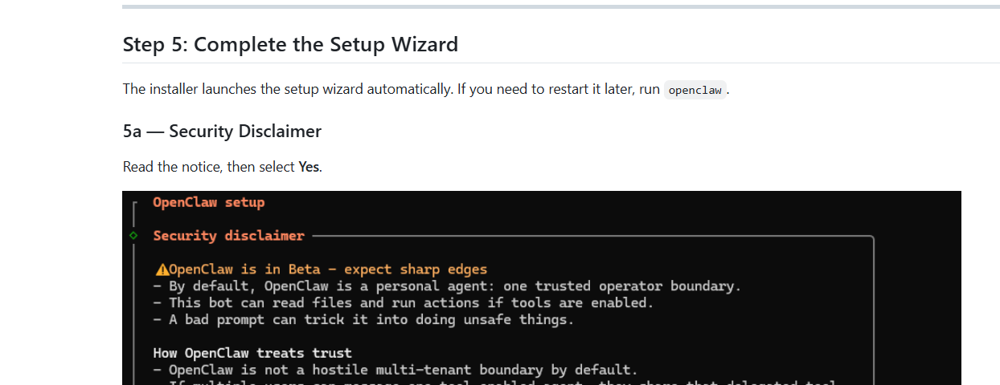

> **Stay Inside WSL**
> Run every OpenClaw command from your **Ubuntu terminal**, not from PowerShell.

---

## Step 8: Open the Dashboard

Make sure the gateway is running first:

```bash
openclaw gateway start
```

> Make sure the gateway is running before opening the dashboard. If it is already running this command is safe to run again.

Then open the dashboard:

```bash
openclaw dashboard
```

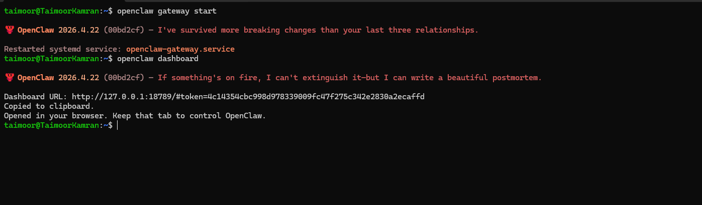

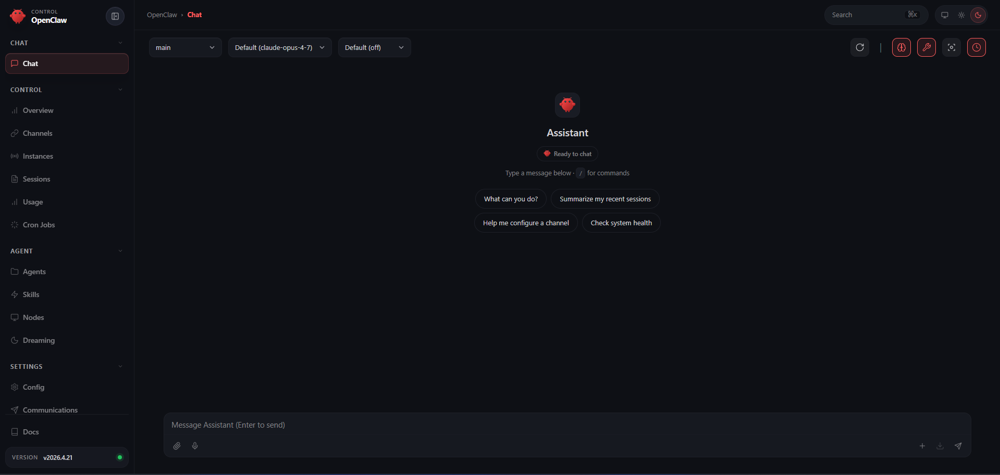

> **After a reboot:** Run `openclaw gateway start` then `openclaw dashboard` to get back to your dashboard.

---

> Continue with the [WhatsApp setup guide](whatsapp_setup/README.md) to connect your first messaging platform.
