# Connect Discord to OpenClaw

This guide walks you through creating a Discord bot and connecting it to OpenClaw so your agent can send and receive Discord messages.

> **Before you start**
> - OpenClaw must already be installed and running.
> - You need a Discord account at https://discord.com
> - You must have a Discord server where you have admin permissions.
> - Node.js 22 or higher is required. Check with: `node --version`

---

## Step 1: Create a Discord Application

Go to https://discord.com/developers/applications

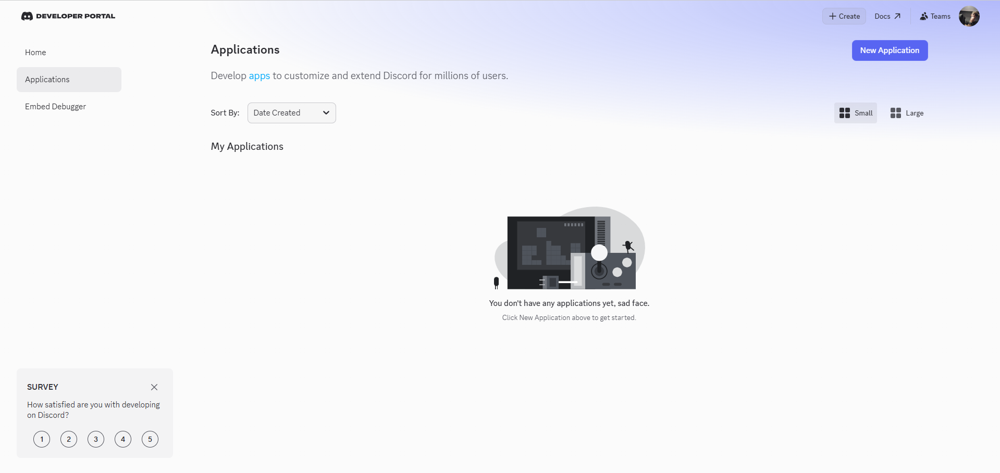

Click **New Application** in the top right.

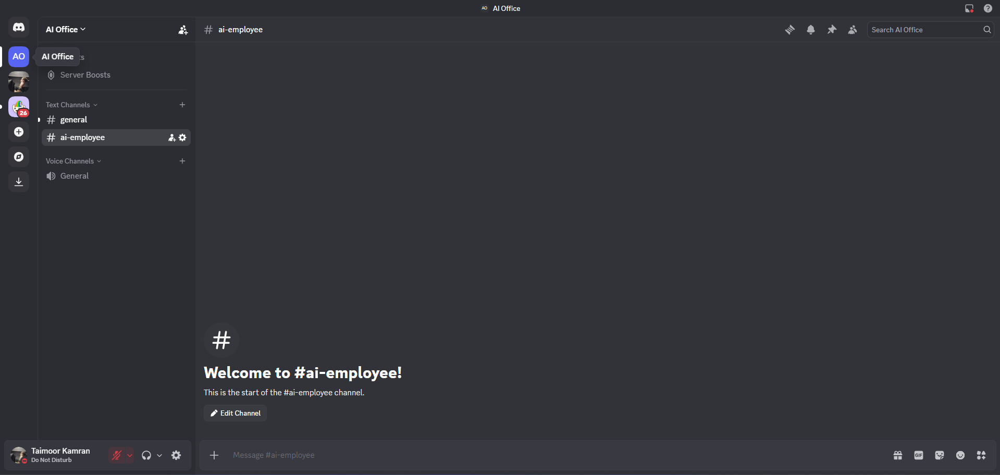

Give your application a name (example: "My OpenClaw Bot") and click **Create**.

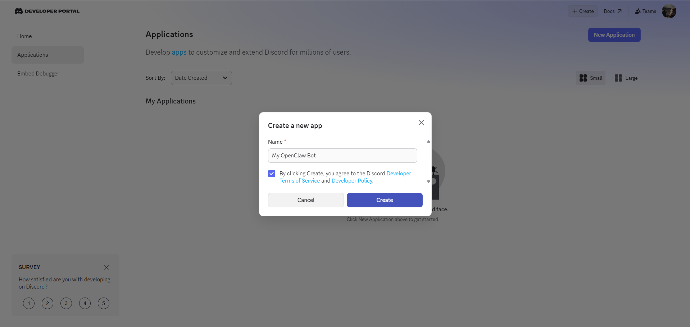

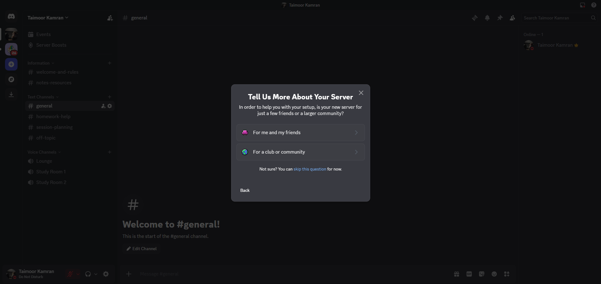

---

## Step 2: Create a Bot User

In the left sidebar, click **Bot**.

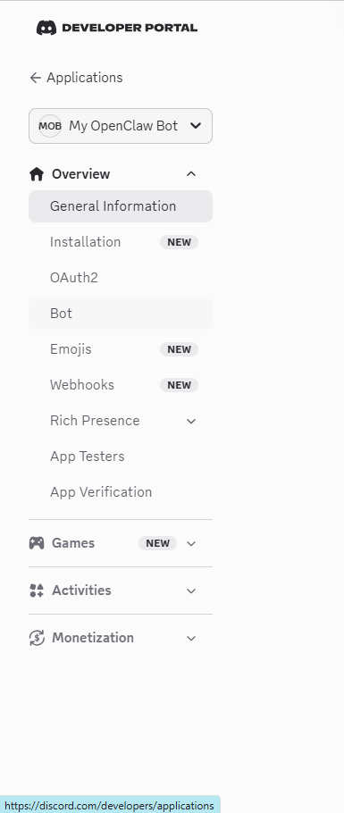

Click **Add Bot**.

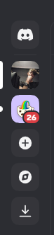

A confirmation dialog appears. Click **Yes, do it!**

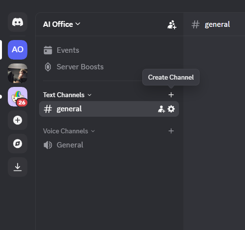

Under **Token**, click **Reset Token**.

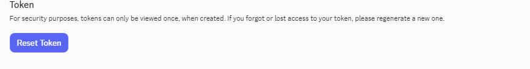

Click **Yes, do it!** again to confirm, then click **Copy** to copy your bot token. Save it somewhere safe — you will need it in Step 4.

> ⚠️ **Keep your token secret!** Never share it or commit it to GitHub. If leaked, reset it immediately.


Scroll down to **Privileged Gateway Intents**.

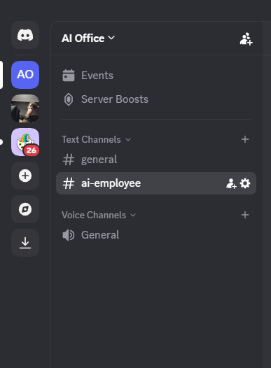

Enable **Presence Intent**.

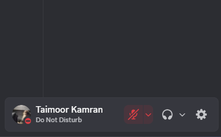

Enable **Server Members Intent**.

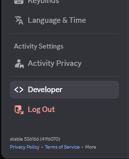

Enable **Message Content Intent**.

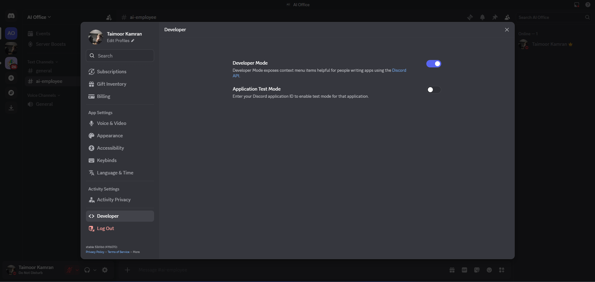

Click **Save Changes**.

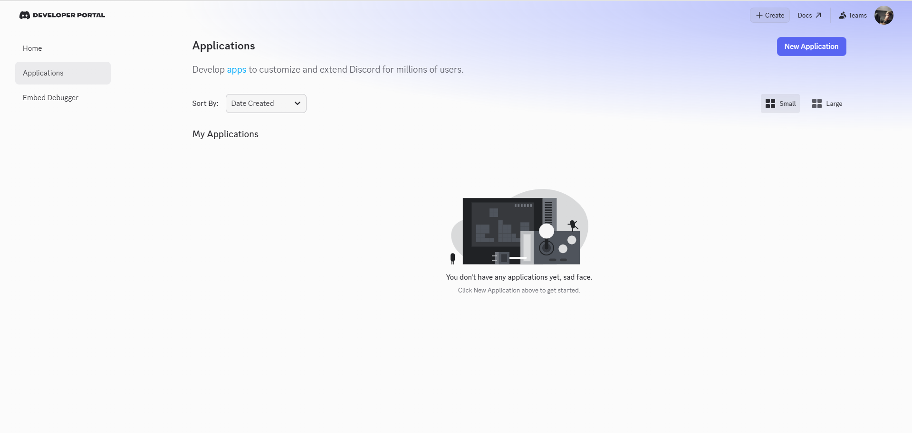

---

## Step 3: Invite the Bot to Your Server

In the left sidebar, click **OAuth2**, then click **URL Generator**.

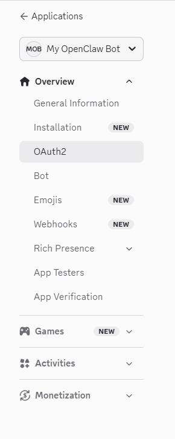

Under **Scopes**, check `bot`.

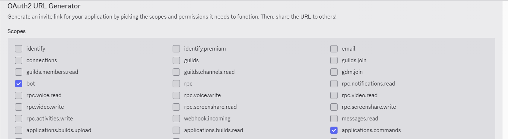

Also check `applications.commands`.

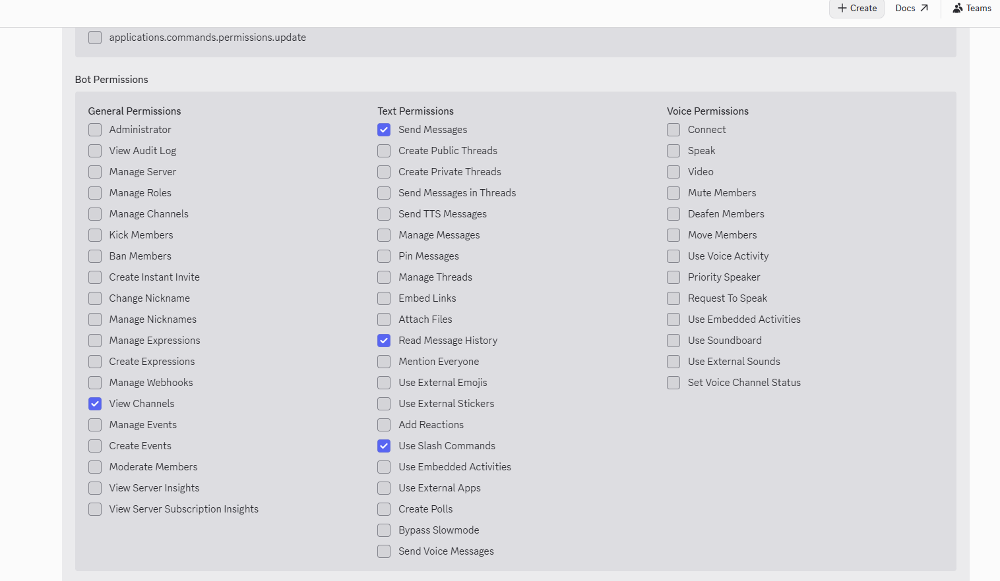

Under **Bot Permissions**, check:
- `Send Messages`
- `Read Message History`
- `View Channels`
- `Use Slash Commands`


Scroll to the bottom and copy the generated URL.

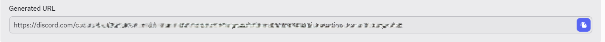

Open the URL in your browser. Select your server from the dropdown.

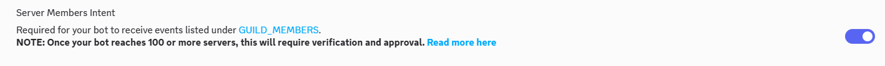

Click **Authorize**.

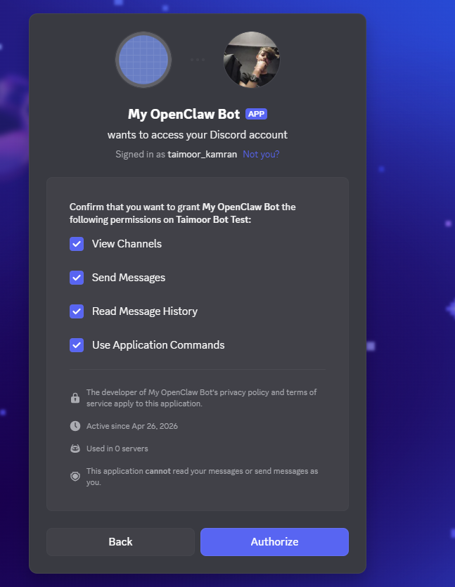

Complete the CAPTCHA if prompted. You will see a confirmation that the bot was authorized.

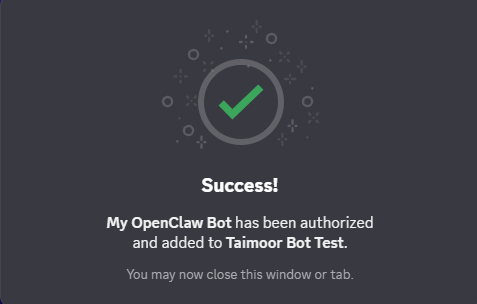

---

## Step 4: Add the Discord Channel — via Dashboard

Make sure the gateway is running:

```bash
openclaw gateway run
```

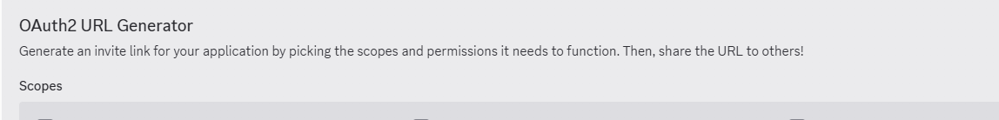

Open your browser and go to `http://127.0.0.1:18789/`

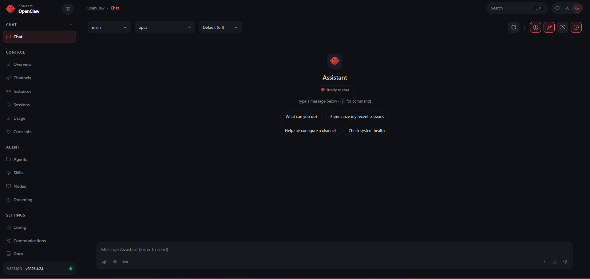

Click **Channels** in the left sidebar.

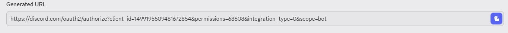

Find **Discord** and click **Configure**.

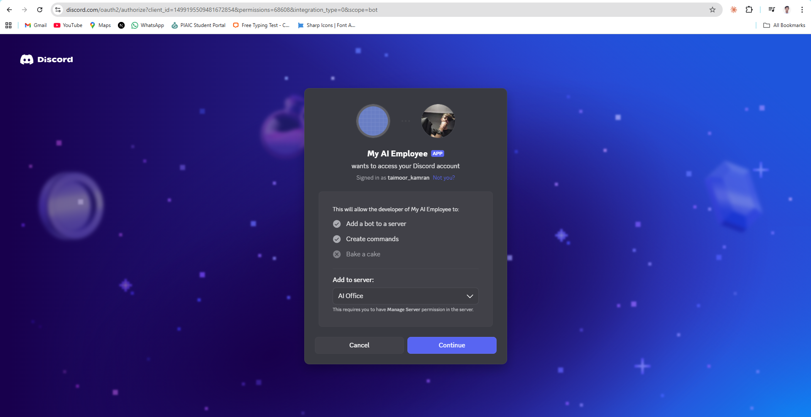

Paste your bot token in the **Token** field.


Also while you're there, enable these two intents by toggling them ON:

**Discord Guild Members Intent**


**Discord Presence Intent**


Click **Save**.

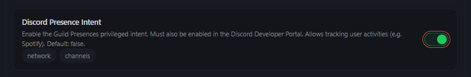

---

## Step 4 (Alternative): Add the Discord Channel — via CLI

If you prefer the terminal, run:

```bash
openclaw channels add --channel discord
```

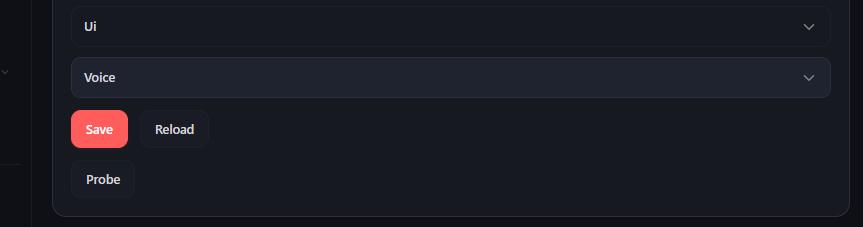

When prompted, paste your bot token and press Enter.

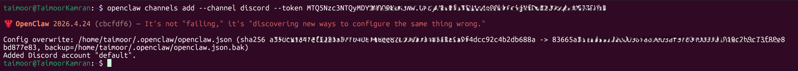

---

## Step 5: Restart the Gateway

After adding the channel, restart the gateway so it picks up Discord:

```bash
openclaw gateway stop
```

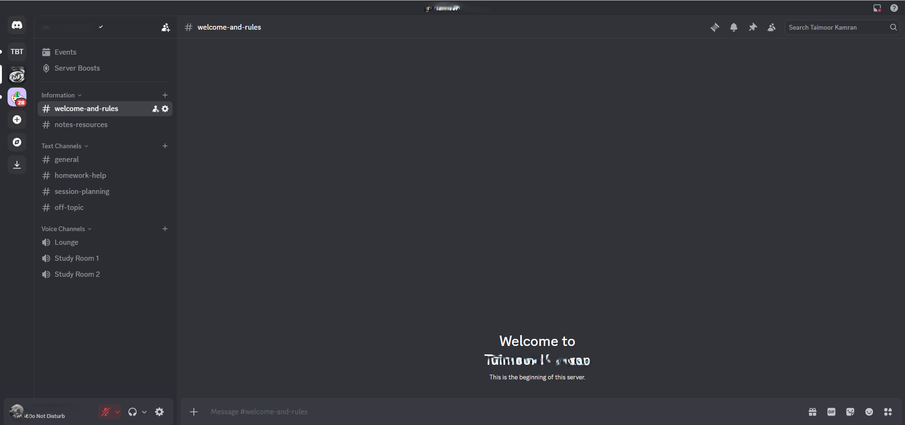

```bash
openclaw gateway run
```


> Wait a few seconds after restart before testing.

---

## Step 6: Allow Your Discord User ID

Before testing, add your Discord user ID to the **Allow From** list so the bot accepts your messages.

**How to get your Discord user ID:**

Open Discord and go to **Settings**.


Click **Advanced**.

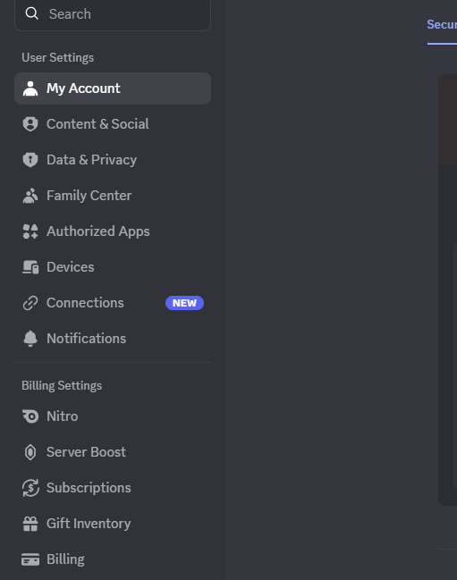

Enable **Developer Mode**.

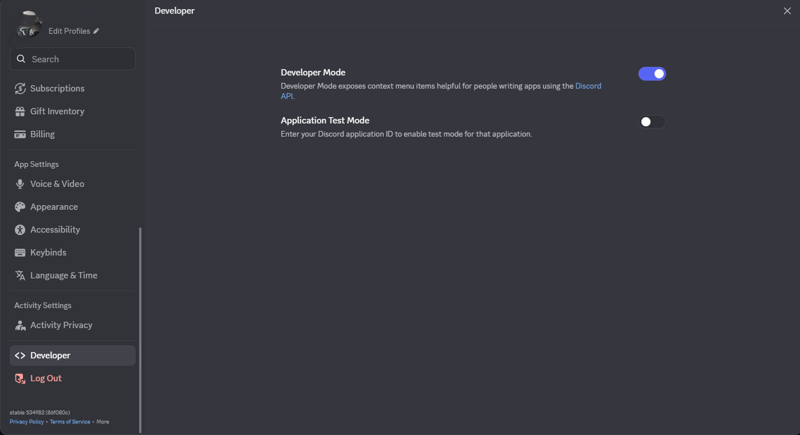

Go back to any server. Right-click your username and click **Copy User ID**.

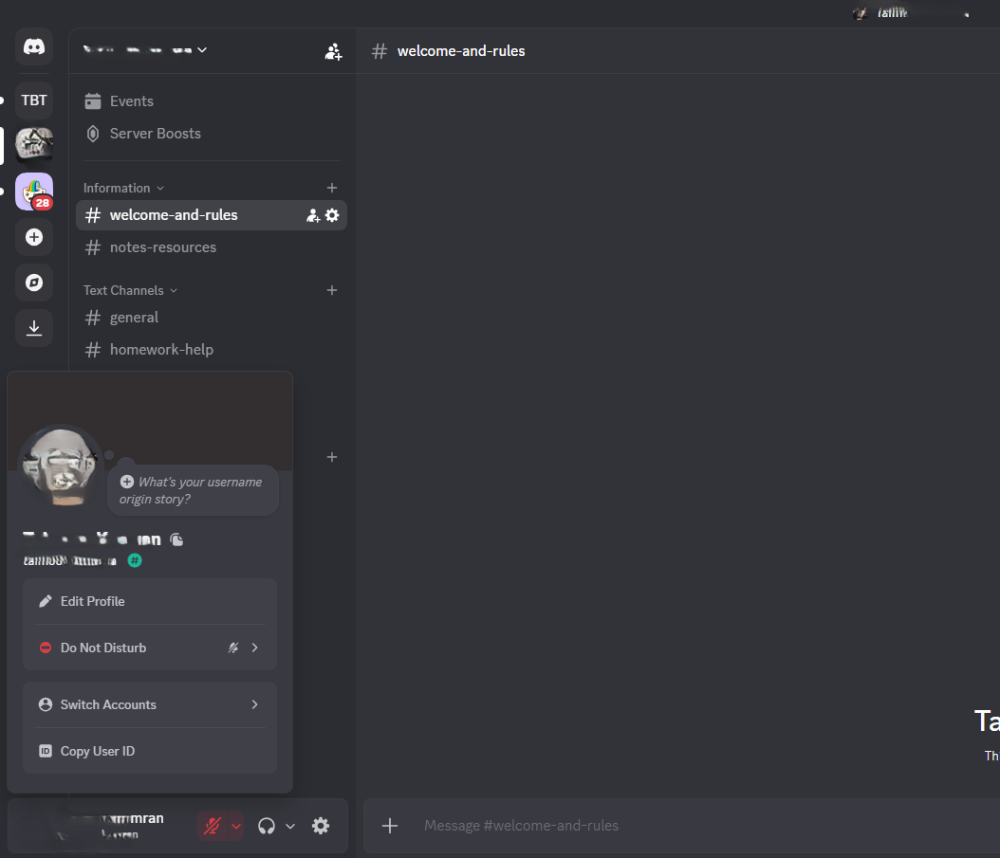

Now go back to the dashboard. Click **Channels** → **Discord**.

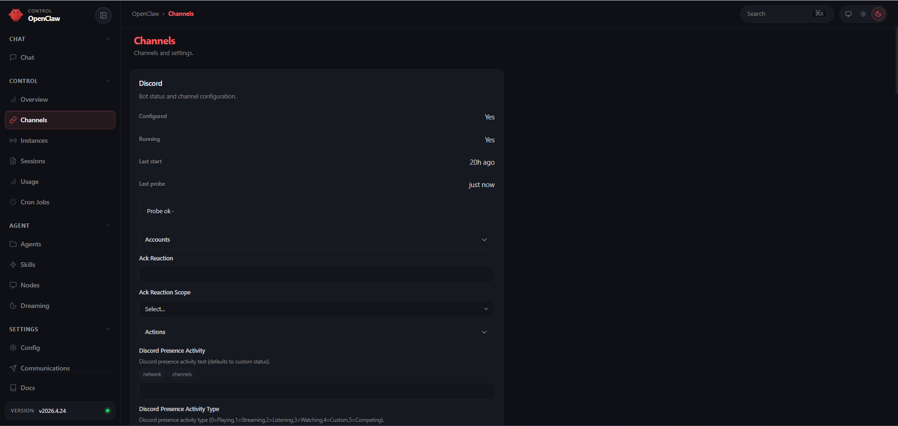

Find the **Allow From** section and click **Add**.

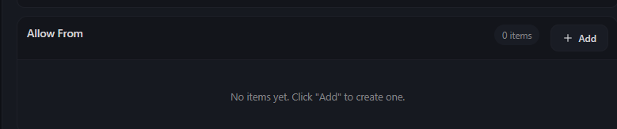

Paste your Discord user ID and click **Save**.

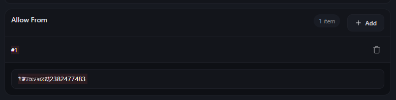

---

## Step 7: Test the Bot

Open Discord and go to your server. Send a message in any channel where the bot has access:

```
hello
```


Or mention the bot directly:

```
@YourBotName what can you do?
```

The bot should reply.


---

## Step 8: Fix Raw JSON Replies (If Needed)

If the bot replies with raw JSON instead of normal text, fix it from the dashboard.

Go to **Channels** → **Discord**.


Enable **Block Streaming** — toggle it **ON**.


Set **Chunk Mode** to `newline`.


Set **Reaction Level** to `minimal`.


Click **Save**.


---

## Quick Checklist

| Issue | Fix |
|---|---|
| Bot not appearing in server | Re-invite using OAuth2 URL Generator |
| Plugin not installed | `openclaw channels add --channel discord` |
| Gateway not running | `openclaw gateway run` |
| Bot not replying | Check Allow From list has your user ID |
| Raw JSON replies | Enable Block Streaming, set Chunk Mode to newline |
| Token invalid | Reset token in Discord Developer Portal and update config |
| Missing intents | Enable all 3 Privileged Gateway Intents in Developer Portal |

---

## Troubleshooting

**Bot is online but not replying** — Check that Message Content Intent is enabled in the Discord Developer Portal. Without it the bot cannot read messages.

**Invalid token error in logs** — Reset your token in the Discord Developer Portal and update it:

```bash
openclaw config set channels.discord.token YOUR_NEW_TOKEN
openclaw gateway restart
```

**Bot was removed from server** — Re-invite it using the OAuth2 URL Generator in Step 3.

**Gateway never started** — Start it with:

```bash
openclaw gateway start
```
