# Connect WhatsApp to OpenClaw

This guide walks you through linking your WhatsApp account to OpenClaw so your agent can send and receive WhatsApp messages.

> **Before you start**
> - OpenClaw must already be installed and running.
> - You need a WhatsApp account on your phone.
> - **Node.js 22 or higher** is required. Check with: `node --version`
> - Recommended: use a separate phone or eSIM — not your main personal number.

---

## Step 1: Make Sure the Gateway is Running

```bash
openclaw gateway start
```

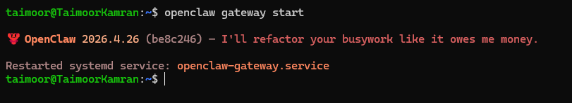

---

## Step 2: Open the Channel Configuration Wizard

```bash
openclaw configure --section channels
```

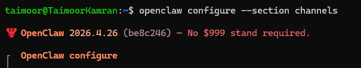

The wizard starts and shows your existing config.

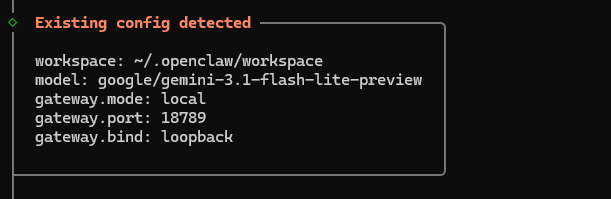

---

## Step 3: Select Gateway Location

When asked **Where will the Gateway run?**, select **Local (this machine)**.

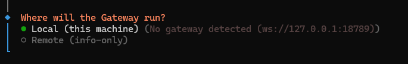

---

## Step 4: Open Channel Setup

When asked **Channels**, select **Configure/link**.

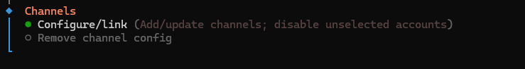

The wizard shows an info box explaining how channels work. Read it, then continue.

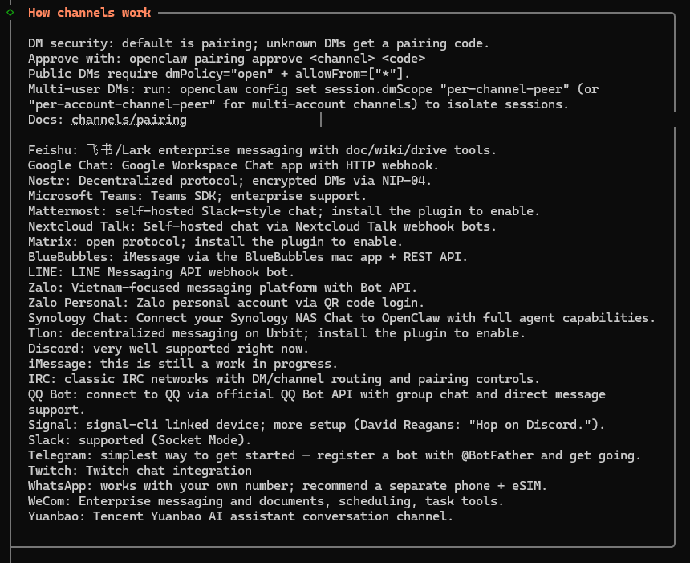

---

## Step 5: Select WhatsApp

When asked **Select a channel**, select **WhatsApp (QR link)**.

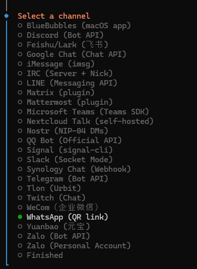

If WhatsApp is already configured, the wizard asks what you want to do. Select **Modify settings**.

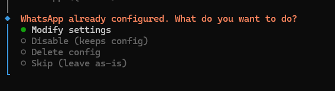

If WhatsApp is already linked, the wizard asks if you want to re-link. Select **No** to keep the existing link, or **Yes** to scan a new QR code.

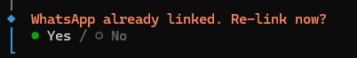

---

## Step 6: Link Your WhatsApp

- The wizard shows a linking info box. Read it, then continue.
- When asked **Link WhatsApp now (QR)?**, select **Yes**.
- A QR code appears in the terminal.
> **The QR code refreshes every ~20 seconds.** Have your phone ready before selecting Yes.

On your phone:
1. Open **WhatsApp**
2. Tap **Settings** → **Linked Devices**
3. Tap **Link a Device**
4. Scan the QR code on your screen

After scanning, the terminal shows:

```
✅ Linked! Credentials saved for future sends.
```


---

## Step 7: Configure DM Settings

The wizard shows the **WhatsApp DM access** info box explaining DM policies.

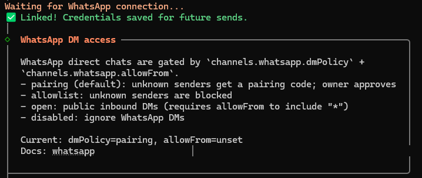

When asked **WhatsApp phone setup**, select **Separate phone just for OpenClaw**.

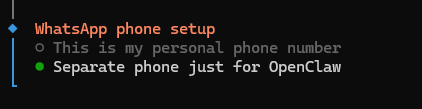

When asked **WhatsApp DM policy**, select **Pairing (recommended)**.

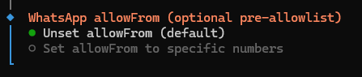

When asked **WhatsApp allowFrom**, select **Unset allowFrom (default)**.


When asked **Select a channel**, select **Finished**.

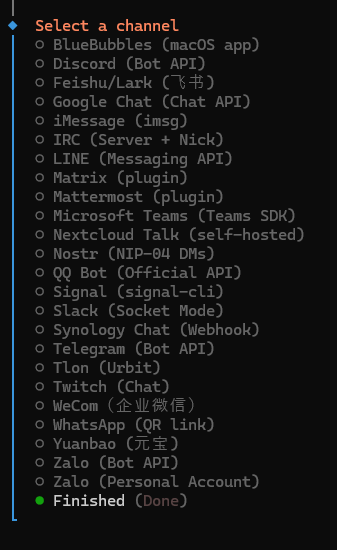

---

## Step 8: Complete Setup

The wizard shows your Control UI URL. Save it.

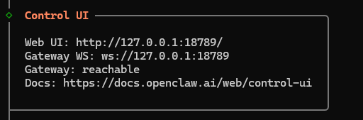

The wizard finishes.


---

## Step 9: Test the Bot

Open WhatsApp on your phone and message the number you linked:

```
hello
```


You will get an automatic reply from your agent, something like:

```
Hello! How can I help you today?
```


Now try messaging from a **different number**. Instead of a reply, that number will receive a **pairing code** — this is how OpenClaw protects your agent from unknown senders.

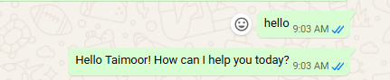

---

## Step 10: Approve the First Message (Pairing)

The first time someone messages your agent, OpenClaw sends them a **pairing code**. You will also see the code in your terminal logs.

To approve it, run:

```bash
openclaw pairing approve whatsapp <code>
```

Replace `<code>` with the code from the terminal output.

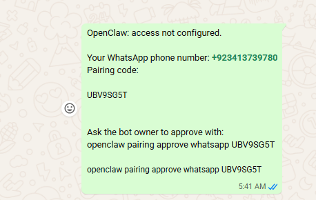

You will see:

```
Approved whatsapp sender +923XXXXXXXXX.
```

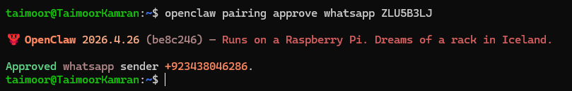

That sender can now chat with your agent freely.

---

> **Open Mode (Optional)**
> To allow anyone to message without a pairing code, run:
> ```bash
> openclaw config set channels.whatsapp.dmPolicy open
> openclaw config set channels.whatsapp.allowFrom '["*"]'
> ```

---

## Quick Checklist

| Issue | Fix |
|---|---|
| QR code expired | Run the wizard again and scan quickly |
| Already 4 linked devices | Remove one in WhatsApp → Linked Devices first |
| Gateway not running | `openclaw gateway start` |
| Bot not replying | Run `openclaw pairing approve whatsapp <code>` |

---

## Troubleshooting

**WhatsApp disconnected after a while** — Re-run the wizard to re-scan:

```bash
openclaw configure --section channels
```

**Agent not replying** — Check gateway status:

```bash
openclaw gateway status
```

Start or restart as needed:

```bash
openclaw gateway start
openclaw gateway restart
```
