# Connect WhatsApp to OpenClaw

This guide walks you through linking your WhatsApp account to OpenClaw so your agent can send and receive WhatsApp messages.

> **Before you start**
> - OpenClaw must already be installed and the dashboard must be open in your browser.
> - You need a WhatsApp account on your phone.
> - Recommended: use a secondary phone number or eSIM — not your main personal number.

---

## Step 1: Open the OpenClaw Dashboard

Run this command in your Ubuntu terminal to open the dashboard:

```bash
openclaw dashboard
```

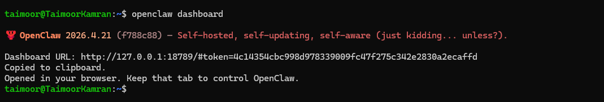

This opens the dashboard in your browser automatically. If it does not open, go to:

```
http://127.0.0.1:18789/
```

If prompted for a token, paste your gateway token. To get it run:

```bash
openclaw config get gateway.auth.token
```


---

## Step 2: Go to Channels

In the dashboard, click **Channels** in the left sidebar.

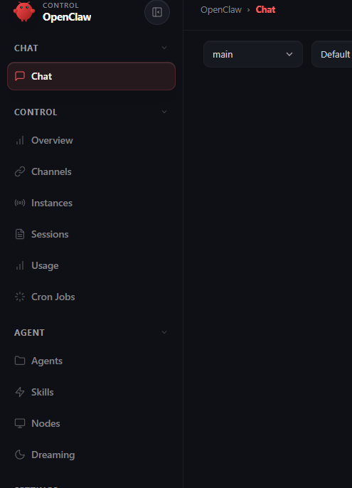

---

## Step 3: Add the WhatsApp Channel (CLI)

In your Ubuntu terminal, run:

```bash
openclaw channels add --channel whatsapp
```

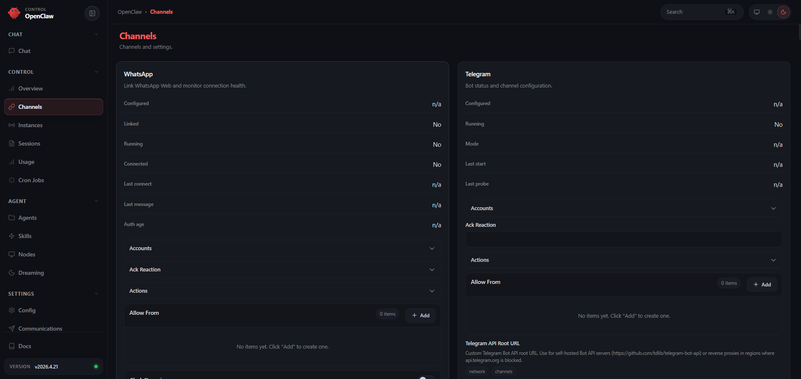

You will see:

```
Added WhatsApp account "default".
```

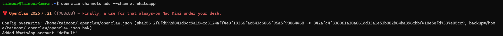

---

## Step 4: Restart the Gateway

After adding the channel, restart the gateway so the dashboard picks it up:

```bash
openclaw gateway restart
```

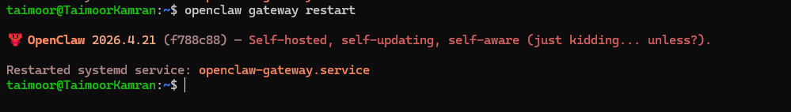

Or stop and start manually:

```bash
openclaw gateway stop
openclaw gateway start
```

---

## Step 5: Link WhatsApp — via Dashboard

Once the gateway is back up, go to your browser:

1. Refresh the dashboard page.
2. Go to **Channels** → **WhatsApp**.
3. Click **Show QR**.


4. A QR code appears on your screen.

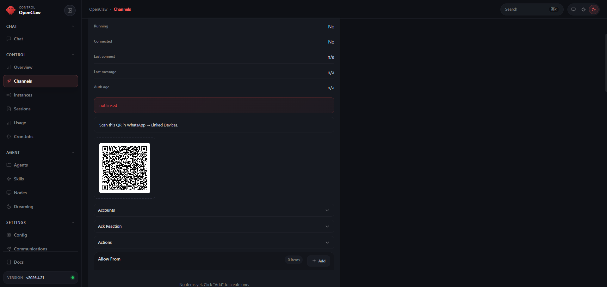

5. On your phone: open **WhatsApp** → **Settings** → **Linked Devices** → **Link a Device** → scan the QR code.

After scanning, the dashboard shows:

```
Linked: Yes
Running: Yes
Connected: Yes
```

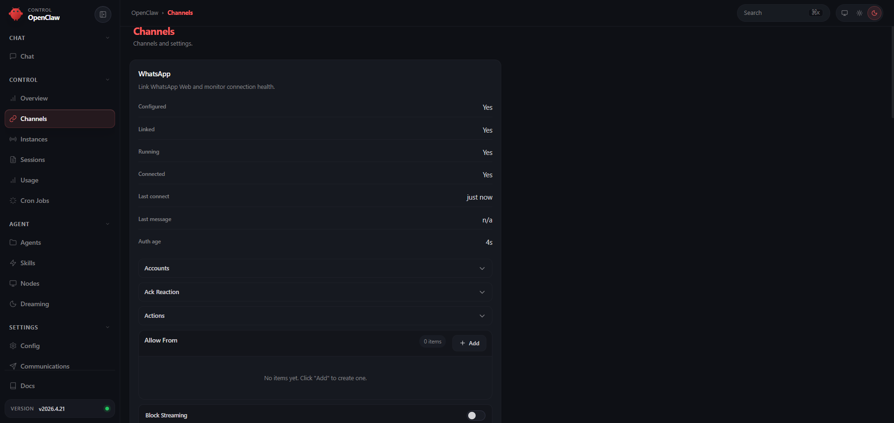

---

## Step 5 (Alternative): Link WhatsApp — via Terminal

If the dashboard QR does not work, you can scan directly from the terminal instead:

```bash
openclaw channels login --channel whatsapp
```

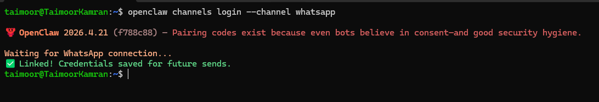

Scan the QR code that appears in the terminal with your phone using the same steps above.

---

## Step 6: Allow Your Phone Number

Before testing, add your phone number to the **Allow From** list so the bot accepts your messages.

In the dashboard, find the **Allow From** section:

1. Click **Add**.
2. Enter your number with country code — example: `+923XXXXXXXXX`.
3. Click **Save**.

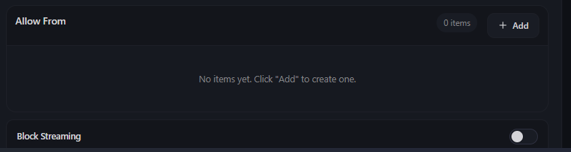

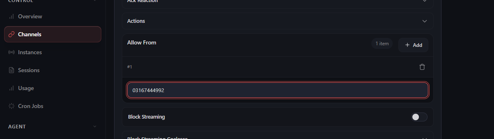

---

## Step 7: Send a Test Message

Open WhatsApp on your phone and send a message to the number you linked. Try:

```
hello
```

or

```
what can you do?
```

OpenClaw should reply.


---

## Step 8: Fix Raw JSON Replies (If Needed)

If OpenClaw replies with raw JSON instead of normal text, fix it from the dashboard:

**1. Enable Block Streaming** — find **Block Streaming** and toggle it **ON**.


**2. Set Chunk Mode to newline** — find **Chunk Mode** and select **newline**.

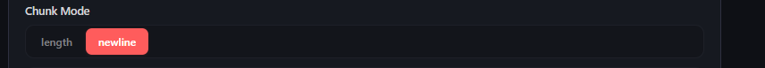

**3. Set Reaction Level to minimal** — find **Reaction Level** and select **minimal**.

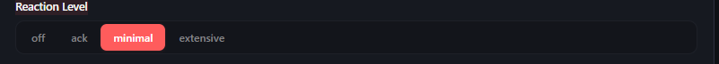

**4. Click Save.**

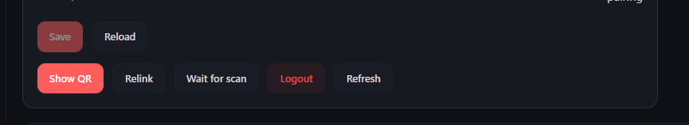

If replies are still raw JSON after saving, update OpenClaw and restart:

```bash
openclaw update
openclaw gateway restart
```

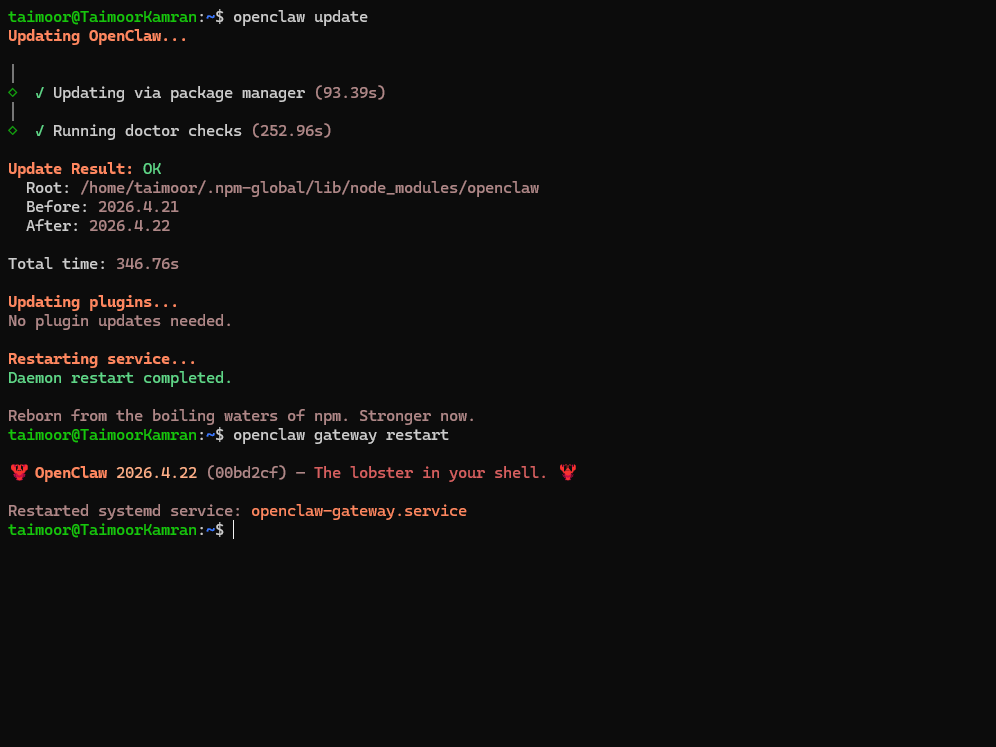

---

## Step 9: Approve the Pairing Code (First DM)

The first time someone new messages your agent, OpenClaw sends a **pairing code** for security. To approve it, run:

```bash
openclaw pairing approve whatsapp <code>
```

Replace `<code>` with the code shown in the message.

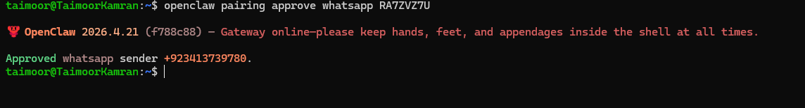

> To allow anyone to message without a pairing code (open mode):
> ```bash
> openclaw config set channels.whatsapp.dmPolicy open
> openclaw config set channels.whatsapp.allowFrom '["*"]'
> ```

---

## Quick Checklist

| Issue | Fix |
|---|---|
| Plugin not installed | `openclaw channels add --channel whatsapp` |
| Gateway not running | `openclaw gateway start` |
| QR expired | Click **Relink** and scan again quickly |
| Already 4 linked devices | Remove an old device in WhatsApp first |
| Raw JSON replies | Enable Block Streaming, set Chunk Mode to newline, Reaction Level to minimal |
| Still broken after settings | `openclaw update` then `openclaw gateway restart` |

---

## Troubleshooting

**WhatsApp disconnected after a while** — Re-scan the QR code:

```bash
openclaw channels login --channel whatsapp
```

**Agent not replying** — Check gateway status:

```bash
openclaw gateway status
```

If stopped, restart it:

```bash
openclaw gateway restart
```
